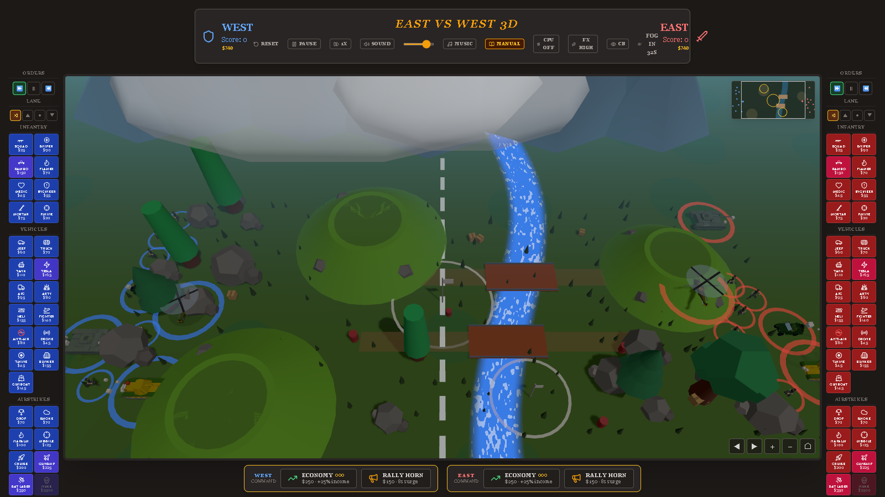

# East vs West 3D

A real-time tug-of-war strategy game inspired by the classic Commodore Amiga title **[North & South](https://en.wikipedia.org/wiki/North_%26_South_(video_game))** (Infogrames, 1989). Command the West or East team, deploy units, and push to the enemy edge to claim victory! Available online here: https://pisberg.github.io/east-vs-west-game/

Play solo against the computer (**Easy / Normal / Hard** — the hard AI counter-picks your army, invests in its economy and maneuvers its forces), two-player hotseat on one keyboard, or **online 1v1** — one player hosts and shares a short room code, the other joins (peer-to-peer, no accounts or install). Five battlefields, two win modes (**100 Points** or **Base HP**).



See [CHANGELOG.md](CHANGELOG.md) for what's new.

## 🎮 How to Play

### Objective
The first team to reach **100 Points** wins.
- **Tanks** score **3 Points**.
- **All other units** score **1 Point**.
- Points are scored by units reaching the far edge of the map.

### Resources
- **Money** generates automatically over time.
- **Supply Drops**: Every ~30s a crate parachutes onto the midfield — the first team to reach it claims **cash ($150)**, a **veteran squad**, or a **field medkit** (heals your whole army). Crate stripe color shows the prize.
- **Refunds**: Units that successfully reach the enemy edge refund 50% of their deployment cost.

### 🕹️ Controls

#### Mouse
- **Click Unit Buttons** (Left/Right side) to spawn units.
- **Click Terrain**: Inspect terrain or targeting (for airstrikes).
- **Camera**: Drag to swing the view (locked to the front 180°), scroll/pinch to zoom — or use the **◀ ▶ + − ⌂ buttons** in the battlefield's corner (hold to keep moving, ⌂ resets the view).
- **Click an Enemy Unit**: Your army focus-fires it for 6 seconds.
- **Orders** (per side): Advance / Hold / Fall Back stances.
- **Troop Control**: Click one of **your own units** to select it (squad-spawned infantry selects as a squad); **double-click to select every unit of that type**. An order panel appears: **⚔ Attack / ⛨ Hold / ⏪ Fall Back / Follow Team**. Per-unit orders override the team stance; a colored dot above each unit shows its personal order. Click open ground or press Esc to deselect.
- **Command bar** (centered under the battlefield): **Economy upgrades** (3 levels, +25% income each — invest early or field units now) and the **Rally Horn** ($150: +45% fire rate & +25% speed for 8 seconds, long cooldown — time it with a push).
- **Field Repairs**: Wounded units heal slowly near their own edge when out of combat — pull damaged veterans back with **Fall Back** instead of feeding kills to the enemy.
- **Battle Feed**: Key events (big-unit kills, bridges, supply drops, capture point, nukes) scroll by in the lower-left corner.
- **Sound & Music**: Toggle SFX mute and the procedural battle-march from the top bar; settings and your menu choices (map, side, CPU level, win mode) are remembered between visits.
- **Minimap** (top-right of the battlefield): live unit dots, capture rings and the camera's current view — **click it to jump the camera** anywhere.
- **Capture Points**: the center flag grants **+50% income**; two smaller flank posts add **+12% each** — spread your lanes to hold them.
- **Challenges** (splash screen): six preset missions with handicaps, time limits and unit restrictions; completions earn permanent badges. Recent battle results also show on the splash.
- **Shortcuts & Access**: number keys **1–0** buy your core units, **P** pauses; **FX** toggles low-graphics for weak devices (auto-detected too); **CB** recolors East to amber for colorblind players.
- **Mobile**: Play on your phone in **landscape** — the layout switches to a compact battle view (slim header, scrollable unit panels) and the field manual is tucked behind the **Manual** button in the top bar (toggleable on desktop too). Portrait shows a rotate prompt.

#### Keyboard Shortcuts
- **West Team (Left)**: `1` - `0`, `-`, `=`
- **East Team (Right)**: `F12` - `F1`

---

## 🎖️ Units & Strengths

### Infantry
| Unit | Role | Weakness |
| :--- | :--- | :--- |
| **Squad** | Basic grunts. Cheap & swarmable. | Splash damage, Snipers. |
| **Sniper** | **Long Range** specialist. High damage, slow reload. 30% Miss chance. | Swarms, Close combat. |
| **Special Forces** | Hero unit. Rapid fire minigun. | Tanks, Artillery. |
| **Flamer** | Short-range cone of fire that ignores cover. | Snipers, anything with range. |
| **Medic** | Heals nearby wounded troops. Unarmed. | Everything that shoots. |
| **P. Mine** | Hidden trap. Explodes on contact. | Engineers, Luck. |
| **Engineer** | Detects & defuses enemy mines, repairs bridges, and welds damaged vehicles & bunkers back to health anywhere on the map. Unarmed. | Everything that shoots. |
| **Mortar** | Indirect splash fire at long range. Stops to shoot. | Rushes, Snipers. |

### Vehicles
| Unit | Role | Weakness |
| :--- | :--- | :--- |
| **Jeep** | **Fast recon**. Rapid MG, races ahead of the column. Has **one seat** — it will pick up a foot soldier in your half and run him to the front (the quickest way to get a slow Engineer to the armor that needs him). | Tanks, Mines. |
| **Truck** | **Troop transport**. Scoops up 6 foot soldiers in your half, delivers them to the front. Unarmed; survivors bail out if it dies. | Everything. |
| **Tank** | **Heavy Armor**. High HP & Damage. The backbone of any push. | Anti-Tank Mines, Air attacks. |
| **Tesla** | Chain-lightning vehicle. Melts infantry, ignores vehicles entirely. | Tanks, Helicopters. |
| **APC** | Armored fighting vehicle; disgorges 3 soldiers when destroyed. | Anti-tank fire. |
| **Artillery** | **Siege Unit**. Massive range & Splash damage. Stationary when firing. | Fast units, Air attacks. |
| **Anti-Air** | **Air Defense**. Essential vs Drones & Helicopters. | Tanks, Infantry. |
| **T. Mine** | Anti-Tank trap. High damage massive explosion. | Infantry (trigger radius). |
| **Bunker** | Static strongpoint placed anywhere on your half. | Artillery, being bypassed. |
| **Gunboat** | Naval gun platform — station it on a river or channel to guard the crossings. | Artillery, aircraft. |

### Air Support
| Unit | Role | Note |
| :--- | :--- | :--- |
| **Helicopter** | **Flying Gunship**. Hovers at range. Attacks Ground & Air. | Anti-Air (AA), Fighters. |
| **Fighter** | **Air superiority jet**. Hunts enemy aircraft, strafes ground. | Anti-Air (AA). |
| **Drone** | **Kamikaze**. Flying bomb. Targets specific units. | Anti-Air (AA). |
| **Airstrike** | **Napalm Run**. Burns a wide area over time. | Cooldown/Money. |
| **Paratroopers** | **Deep Strike**. Drop squad behind enemy lines. | Vulnerable while falling. |
| **Missile** | **Precision Strike**. High damage to single point. | - |
| **Smoke** | **Concealment**. Blocks targeting into/out of the cloud (~13s). Counters snipers & artillery. | Close assaults, Air units. |
| **Cruise Missile** | Sea-launched from beyond the map edge. Flies in low, big warhead. | Cost. |
| **Gunship** | Heavy flyover: rakes the target zone with a burst-fire strafing run. | Anti-Air (AA). |
| **Satellite Laser** | Orbital beam: red designator, then a sustained burn that melts a zone. | Cost, telegraphed. |
| **Nuke** | **Mass Destruction**. Huge area damage. Friendly Fire Enabled! | Use with caution! |

---

## 🌍 Terrain & Tactics
- **Entrenchment**: Foot soldiers that hold still under **Hold** orders dig in after ~6 seconds — a foxhole with sandbags appears and they take **45% less direct fire** until they move. Explosive weapons ignore foxholes.

- **Hills**: Units on hills get **+30% Range** and **-20% Reload Time**. Key for artillery.
- **Cover (Trees/Rocks)**: Infantry will automatically seek cover. Reduces incoming damage by **60%**.
- **River**: Slows down infantry. Vehicles MUST use bridges to cross.
- **Bridges are destructible**: Artillery, missiles and mines collapse them — vehicles are blocked until the bridge is repaired (infantry can wade, slowly). A broken bridge shows a bobbing wrench marker: build an **Engineer** and he'll walk there and reopen it in seconds. Left alone, bridges slowly self-repair (~1 minute), so the front never stalls forever.
- **Water Disadvantage**: Units wading in the river (not on bridge) have **-60% Range**.
- **Winter map — frozen river**: The channel is iced over. Infantry walk **straight across the ice anywhere** (slowed, and caught in the open), while vehicles still funnel over the bridges — hold the crossings or get flanked over the ice. Gunboats can't anchor in a frozen channel, and it snows instead of raining.
- **Battlefield wear**: Supply crates splinter and fuel barrels cook off (small blast!) when caught in explosions or crushed by vehicles; tanks and jeeps leave faint tread marks. Debris and marks fade away on their own.
- **Wrecks are cover**: A destroyed tank doesn't vanish — it burns where it died. The hulk is real terrain: your infantry duck behind it like a boulder, vehicles drive around it, and it smolders for the better part of a minute before sinking away. The battlefield ends up telling the story of the fight — and a knocked-out vehicle in a chokepoint changes the next push through it.
- **Air Command**: All air-delivered strikes — airstrike, paradrop, missile, cruise, gunship, nuke — share one **rearm clock** (~22s, 60s after a nuke). No more back-to-back strike chains; locked buttons show the countdown. And strikes can be **shot down**: Anti-Air guns lead incoming strike aircraft, and a downed plane takes its payload with it — an AA screen is a real answer to an air-happy opponent.

---

## 🙏 Asset Credits

3D unit models, mostly via [Poly Pizza](https://poly.pizza/) — thank you to these artists for the free packs:

- **Soldier** (all infantry) and **Tank** by [Quaternius](https://quaternius.com/) — [CC0](https://creativecommons.org/publicdomain/zero/1.0/)
- **Artillery, Tesla and Bunker** from the Turret Pack by [Quaternius](https://quaternius.com/) — CC0 (converted from OBJ to glTF)
- **Jeep, Truck, Light Tank (APC) and Helicopter** from the [Low Poly Military Vehicles](https://poly.pizza/bundle/Low-Poly-Military-Vehicles-lSgBuYh48X) bundle, **Missile Turret** (Anti-Air) and **[Military Boat](https://poly.pizza/m/wouBxOe3CD)** (Gunboat) by [Zsky](https://poly.pizza/u/Zsky) — [CC-BY 3.0](https://creativecommons.org/licenses/by/3.0/)
- **Low poly Fighter** by [Stephen Graybill](https://poly.pizza/m/1fi8ZIDdFCP) — CC-BY 3.0
- **Drone** by [NateGazzard](https://poly.pizza/m/DNbUoMtG3H) — CC-BY 3.0

---

## 🕹️ Inspiration

East vs West is a loving nod to **[North & South](https://en.wikipedia.org/wiki/North_%26_South_(video_game))** (Infogrames, 1989), the Amiga/Commodore-era classic based on the *Les Tuniques Bleues* comics: two armies tugging over one front line, battles you can pick up and play in seconds, and a tone that never takes the war too seriously. This project reimagines that spirit as a modern real-time 3D lane battle — with a procedural military march instead of a chiptune, and a nuke button the original never dared to ship.

---

## 🛠️ Run Locally

**Prerequisites:** Node.js

1. Install dependencies:
   ```bash
   npm install
   ```
2. Run the development server:
   ```bash
   npm run dev
   ```

[](https://scorecard.dev/viewer/?uri=github.com/PIsberg/east-vs-west-game)
